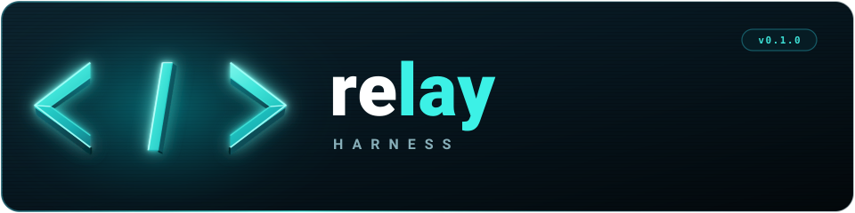

<p align="center">
  
</p>

# Relay

Relay is a terminal coding agent and the harness around it. The agent reads files, runs commands, edits code, and works through multi-step tasks with any model: a hosted provider, a subscription, or a local endpoint.

The harness is the part that stays the same when the model changes. Four rules run on every request, whatever model is behind it, and they need no extra model call. Relay is minimal by design: it ships strong defaults and leaves sub-agents, plan mode, and similar features to extensions you write or install.

## Why a harness

Coding agents fail in predictable ways. They ignore a constraint you stated three messages ago, edit files when you only asked a question, report "done" when the tests failed, and drown in stale tool output. Relay's harness core targets these failures directly:

| Pillar | Problem | What Relay does |
|---|---|---|
| Alignment | The agent forgets constraints, treats questions as permission to edit, runs destructive commands. | Keeps your standing rules as state and restates them on every request. Asks before destructive or external commands. Blocks the first edit in a turn where you only asked a question. |
| Evidence | The agent claims success without a passing check. | Records what changed and which checks passed. A completion claim without a passing check after the last change gets one verification request. Checks with masked exit codes (`\| tail`, `\|\| true`) do not count. Large changes and files are flagged. |
| Context | Old tool results describe states that no longer exist. | Sends recent results verbatim, replaces old large ones with one-line stubs, and restates a compact progress digest. |
| Skills | Skill structure changes how the agent uses it, and nobody measures it. | Treats `SKILL.md` as a router, measures which resources lead to actions, and audits skill structure. |

Inspect the state with `/harness` and tune it through the `harnessCore` settings. See [Harness Core](packages/coding-agent/docs/harness-core.md).

## Getting started

Relay requires Node.js 22.19 or newer. Build it from source:

```bash
git clone https://github.com/eltonssouza/relay-harness.git
cd relay-harness
npm install --ignore-scripts
npm run build
```

Run it from the sources in any directory:

```bash
./relay-test.sh      # Linux and macOS
./relay-test.ps1     # Windows PowerShell
```

Inside Relay, run `/login` to connect a subscription or API key, then give it a task. Relay stores its configuration in `~/.relay/agent` and project resources in `.relay/`.

`npm run build` refreshes model data from the network first. Use `npm run build:offline` to rebuild from existing model data.

### Nix

```bash
nix run github:eltonssouza/relay-harness
```

Use `nix build .` or `nix run .` to build or run your checkout. Nix builds are offline, so bundled model data comes from the revision pinned in `nix/model-catalog.json`. Refresh the pin with `npm run update:model-catalog-pin`.

## What you can do with it

- Work [interactively](packages/coding-agent/docs/usage.md) in the terminal, branch and resume [sessions](packages/coding-agent/docs/sessions.md).
- Script it with [print and JSON modes](packages/coding-agent/docs/cli.md), or control a separate process over [RPC](packages/coding-agent/docs/rpc.md).
- Embed it in an application with the [TypeScript SDK](packages/coding-agent/docs/sdk.md).
- Extend it with [extensions](packages/coding-agent/docs/extensions.md), [skills](packages/coding-agent/docs/skills.md), [prompt templates](packages/coding-agent/docs/prompt-templates.md), [themes](packages/coding-agent/docs/themes.md), and [MCP servers](packages/coding-agent/docs/mcp.md). Share them as [Relay packages](packages/coding-agent/docs/packages.md) through npm or git.
- Connect any model through [providers](packages/coding-agent/docs/providers.md), [custom providers](packages/coding-agent/docs/custom-provider.md), or a local [llama.cpp](packages/coding-agent/docs/llama-cpp.md) server.

Start with the [documentation index](packages/coding-agent/docs/index.md) or the [quickstart](packages/coding-agent/docs/quickstart.md).

## Packages

This monorepo holds the Relay CLI and the libraries it is built from.

| Package | Description |
|---------|-------------|
| **[@relay-harness/coding-agent](packages/coding-agent)** | The `relay` command: interactive coding agent, harness core, sessions, extensions |
| **[@relay-harness/agent-core](packages/agent)** | Agent runtime with tool calling, state management, and the model-independent harness |
| **[@relay-harness/ai](packages/ai)** | Unified multi-provider LLM API with model discovery |
| **[@relay-harness/tui](packages/tui)** | Terminal UI library with differential rendering |
| **[@relay-harness/durable](packages/durable)** | Durable conversation, task, and document runtime |
| **[@relay-harness/mcp](packages/mcp)** | Standalone Model Context Protocol client |
| **[@relay-harness/codemode](packages/codemode)** | Sandboxed JavaScript execution where the only capability is calling injected tools |
| **[@relay-harness/telemetry](packages/telemetry)** | Vendor-neutral telemetry contracts and typed schemas |
| **[@relay-harness/protocol](packages/protocol)**, **[client](packages/client)**, **[server](packages/server)** | Experimental remote sessions over framed CBOR |
| **[@relay-harness/evals](packages/evals)** | Evaluation harness for the coding agent |
| **[@earendil-works/chord](packages/chord)** | Application-composition runtime for services, replicated state, RPC, and plugins |

## Permissions and containerization

Relay has no sandbox for filesystem, process, network, or credential access. It runs with the permissions of the user who started it. The harness asks before destructive or external commands, but that is a safeguard against mistakes, not a security boundary.

For stronger isolation, see [containerization](packages/coding-agent/docs/containerization.md): a Gondolin micro-VM extension, plain Docker, or an OpenShell sandbox. Review [Security](packages/coding-agent/docs/security.md) before using untrusted repositories, extensions, or unattended automation.

## Development

```bash
npm install --ignore-scripts   # Install dependencies without lifecycle scripts
npm run build                  # Refresh model data, then build all packages
npm run build:offline          # Build with existing model data
npm run check                  # Lint, format, and type check
./test.sh                      # Run tests that need no API keys
```

See [CONTRIBUTING.md](CONTRIBUTING.md) for contribution rules and [AGENTS.md](AGENTS.md) for project conventions, which apply to humans and agents alike.

### Standalone binaries

A release source archive builds the same standalone binaries as the official release:

```bash
VERSION="<release-version>"
tar -xzf "relay-${VERSION}-source.tar.gz"
cd "relay-${VERSION}"
./scripts/build-binaries.sh --offline-model-data --platform linux-x64 --out "$PWD/out"
```

`--offline-model-data` uses the model data in the archive without refreshing provider catalogs. Pass `--skip-install` if dependencies are already installed.

## Supply-chain hardening

Dependency changes are reviewed as code.

- Direct external dependencies are pinned to exact versions. Workspace packages use version ranges.
- `.npmrc` sets `save-exact=true` and `min-release-age=2` to avoid same-day releases.
- `package-lock.json` is the ground truth. Pre-commit blocks lockfile commits unless `RELAY_ALLOW_LOCKFILE_CHANGE=1`.
- `npm run check` verifies pinned dependencies, native TypeScript import compatibility, and the generated install lock in `packages/coding-agent/install-lock/`.
- Installs use `--ignore-scripts`, and CI runs `npm ci --ignore-scripts` plus a scheduled `npm audit` and signature check.
- The install lock has an explicit allowlist for lifecycle scripts. New ones fail the checks until reviewed.

## License

MIT
